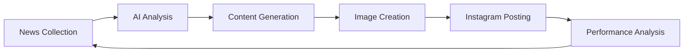

# 🤖 AutoGram

AutoGram is an intelligent AI agent that automates AI news curation and Instagram content management. It seamlessly collects tech news, generates engaging visuals, and maintains your social media presence - all on autopilot.

<div align="center">
    <h3>🔄 Collect → 🧠 Analyze → 🎨 Create → 📱 Share</h3>
</div>

## ✨ Key Features

- **Smart News Aggregation**: Automatically collects and filters AI & tech news
- **AI-Powered Content Creation**: Generates unique, branded images for each post
- **Automated Instagram Management**: Handles posting and scheduling
- **Performance Analytics**: Tracks engagement and optimizes content strategy
- **Self-Learning**: Improves content selection based on performance
- **Brand Consistency**: Maintains your visual identity across all posts

## 🛠️ Tech Stack

- **Core Engine**: Python 3.9+
- **AI Services**: 
  - Google Gemini (content analysis)
  - Replicate SANA (image generation)
- **News Sources**: GNews API
- **Social Platform**: Instagram API
- **Processing**: aiohttp, asyncio
- **Validation**: Pydantic
- **Image Handling**: Pillow


## 🚀 Quick Start

1. **Clone & Install**
```bash
git clone https://github.com/ranahaani/autogram.git
cd autogram
python -m venv venv
source venv/bin/activate  # Windows: venv\Scripts\activate
pip install -r requirements.txt
```

2. **Configure Environment**
```bash
# Create .env file
cp .env.example .env

# Add your API keys
GEMINI_API_KEY=your_key_here
REPLICATE_API_TOKEN=your_token_here
IG_USERNAME=your_username
IG_PASSWORD=your_password
```

3. **Configure Agent**
```json
// config.json
{
    "name": "AutoGram",
    "post_frequency": 3,
    "max_news_age": 24,
    "output_dir": "./output",
    "brand_theme": {
        "primary_color": "#FF6B6B",
        "secondary_color": "#4ECDC4",
        "font_style": "modern"
    }
}
```

4. **Launch**
```bash
python main.py
```

## 📊 Monitoring Dashboard

```plaintext
📈 Performance Metrics
- Posts Created: 125
- Engagement Rate: 3.2%
- Top Performing Topics: AI, Machine Learning, Tech Innovation
- Average Likes: 234
- Comment Rate: 2.1%
```

## ⚙️ Advanced Configuration

### Custom News Sources
```python
class NewsSource:
    async def fetch(self) -> List[NewsItem]:
        # Your custom news source logic
        pass
```

### Content Templates
```python
TEMPLATES = {
    "tech_news": "Modern minimalist tech visualization: {title}",
    "ai_update": "Futuristic AI concept representing: {content}",
    "innovation": "Creative tech breakthrough visual for: {topic}"
}
```

## 🔄 Workflow



## 🚧 Error Handling

AutoGram includes robust error handling:
- Automatic retry mechanisms
- Graceful degradation
- State persistence
- Error notifications
- Performance monitoring

## 📱 Sample Output

```plaintext
📸 Generated Post Example:
- Title: "Breaking: New AI Model Achieves Human-Level Performance"
- Image: Modern tech visualization
- Hashtags: #AI #TechNews #Innovation #FutureOfTech
- Engagement: 543 likes, 27 comments
```

## 🛡️ Best Practices

1. **Content Strategy**
   - Post during peak engagement hours
   - Maintain consistent branding
   - Use trending hashtags
   - Monitor performance metrics

2. **System Management**
   - Regular log monitoring
   - Backup configuration files
   - Update API keys periodically
   - Monitor resource usage

## 🔮 Roadmap

- [ ] Multi-platform support
- [ ] AI-powered hashtag optimization
- [ ] Advanced analytics dashboard
- [ ] Custom template builder
- [ ] Engagement automation
- [ ] A/B testing system

## 🤝 Contributing

Contributions are welcome! Please read our [Contributing Guidelines](CONTRIBUTING.md) for details on our code of conduct and the process for submitting pull requests.

## 📫 Support

- 📧 Email: support@autogram.ai
- 💬 Discord: [AutoGram Community](https://discord.gg/autogram)
- 📚 Documentation: [docs.autogram.ai](https://docs.autogram.ai)

## 📜 License

AutoGram is licensed under the MIT License - see the [LICENSE](LICENSE) file for details.

---

<div align="center">
    <p>Built with ❤️ by the AutoGram Team</p>
    <p>Copyright © 2024 AutoGram</p>
</div>
